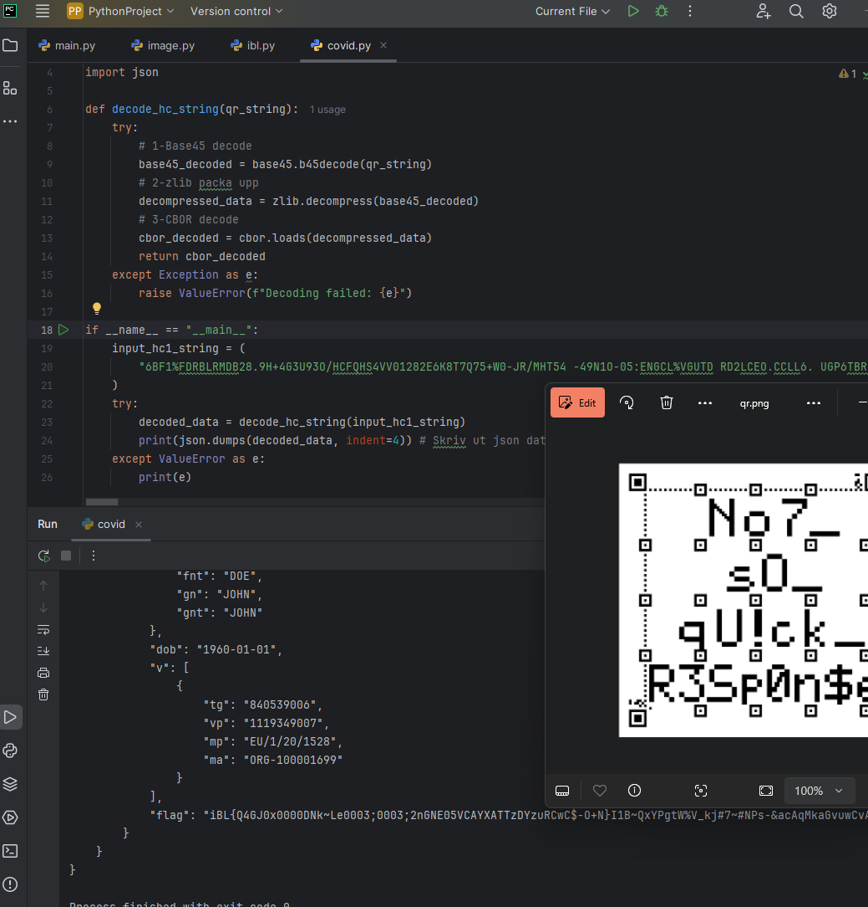
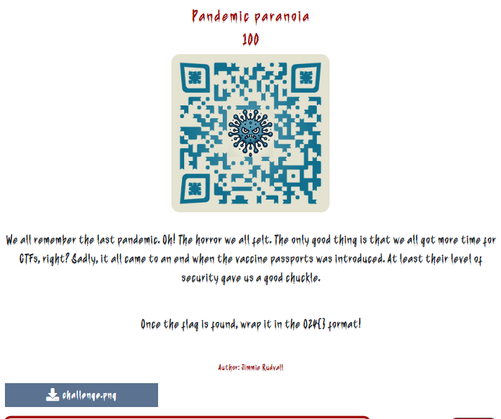
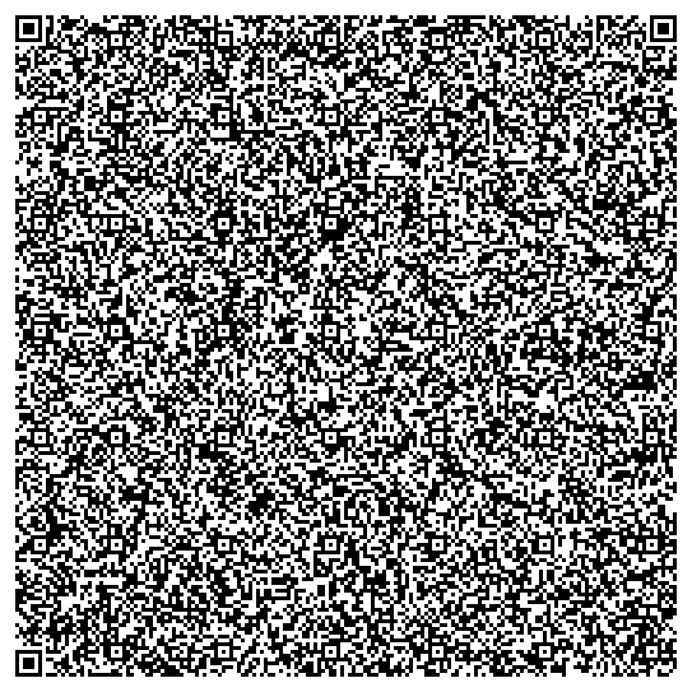

# Pandemic Paranoia
**Category:** Misc  
**Value:** 100  
**Time:** December 16th, 4:26:33 PM

**Description:**  
A multi-step challenge involving QR code analysis and decoding of an HC vaccine certificate.

1. QR Code Analysis:
   - Scan QR code using an online scanner such as [scanqr.org](https://scanqr.org/)
   - The scan shows a string starting with 'HC1:'
   - 'HC1' stands for Health Certificate version 1, identifying this as an possible EU COVID-19 vaccine certificate data.

2. HC Certificate Decoding:
   - The data following "HC1:" needs three decoding steps according to [What's Inside the EU Green Pass QR Code?](https://gir.st/blog/greenpass.html)
   - Base45 decoding --> Zlib decompression --> CBOR decoding
   -  A python script can then be created to decode the certificate and output the JSON data about the certificate.

```python
import base45
import zlib
import cbor
import json

def decode_hc_string(qr_string):
    try:
        # 1-Base45 decode
        base45_decoded = base45.b45decode(qr_string)
        # 2-zlib decompress
        decompressed_data = zlib.decompress(base45_decoded)
        # 3-CBOR decode
        cbor_decoded = cbor.loads(decompressed_data)
        return cbor_decoded
    except Exception as e:
        raise ValueError(f"Decoding went wrong! : {e}")

if __name__ == "__main__":
    input_hc1_string = (
        "---HC1 STRING HERE ---"
    )
    try:
        decoded_data = decode_hc_string(input_hc1_string)
        # Skriv ut JSON formaterad data om vaccinet
        print(json.dumps(decoded_data, indent=4))  
    except ValueError as e:
        print(e)
```

3. See the flag:
   - The decoded JSON data contains a flag field: `"flag": "iBL{Q4GJ0x0000DNk~Le0003;0003;2nGNE...."`
   -  When running the data in [CyberChef](https://gchq.github.io/CyberChef/) it show it should be a PNG encoded in Base85.
   - Creating a python script to decode the data using Base85 and outputting the PNG image.

```python
from PIL import Image
from io import BytesIO

# Skapa base85 tecken att anv
BASE85_ALPHABET = '0123456789ABCDEFGHIJKLMNOPQRSTUVWXYZabcdefghijklmnopqrstuvwxyz!#$%&()*+-;<=>?@^_`{|}~'
BASE85_INDEX = {ch: i for i, ch in enumerate(BASE85_ALPHABET)}

# Funktion för att dekoda Base85
def from_base85(encoded_str):
    decoded_bytes = bytearray() 
    value = 0
    count = 0

    for char in encoded_str:
        value = value * 85 + BASE85_INDEX[char] 
        count += 1
        if count == 5:  # Varje 5:e tecken ger 4 bytes
            decoded_bytes.extend(value.to_bytes(4, byteorder='big'))
            value = 0
            count = 0
    # fix om längden inte är en multipel av 5
    if count > 0:
        decoded_bytes.extend(value.to_bytes((count * 8 + 7) // 8, byteorder='big'))
    return bytes(decoded_bytes)

# Funktion för att spara den dekodade bilddatan som en PNG
def save_png(decoded_data, output_file):
    image = Image.open(BytesIO(decoded_data))
    image.save(output_file)
    print(f"Bilden har sparats som {output_file}")

# Funktion för att visa bilden
def display_image(decoded_data):
    image = Image.open(BytesIO(decoded_data))
    image.show()
```


QR Images:





