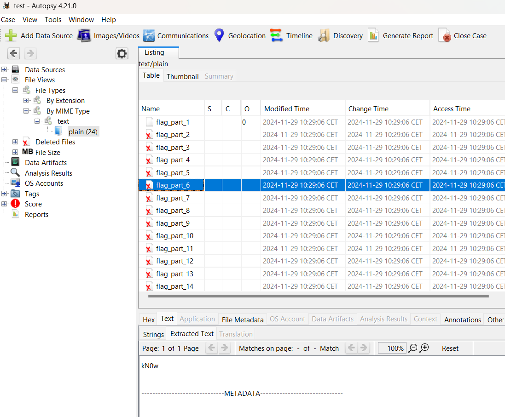
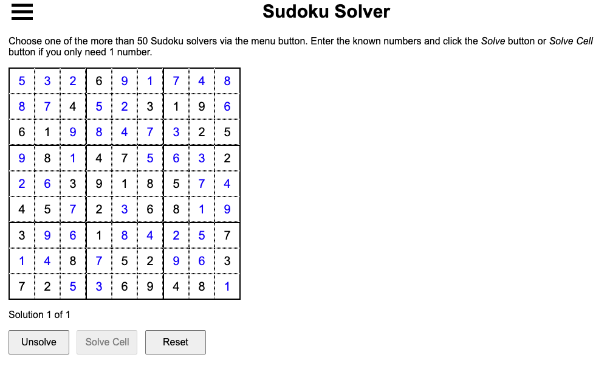
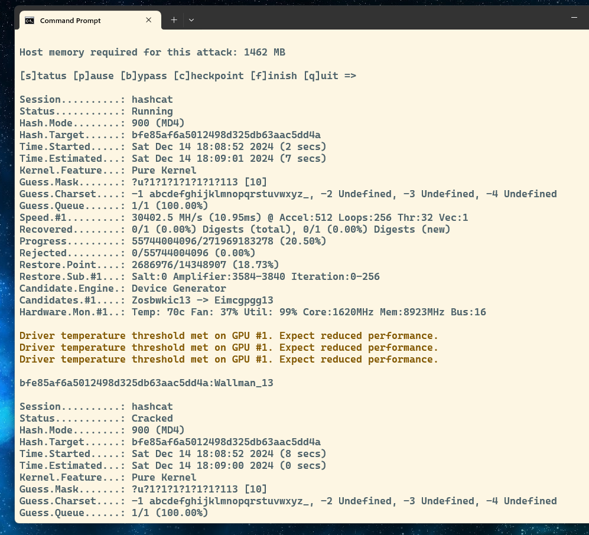
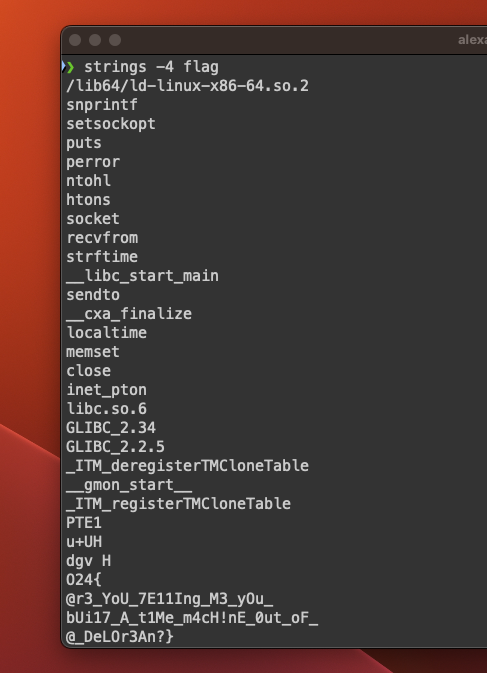
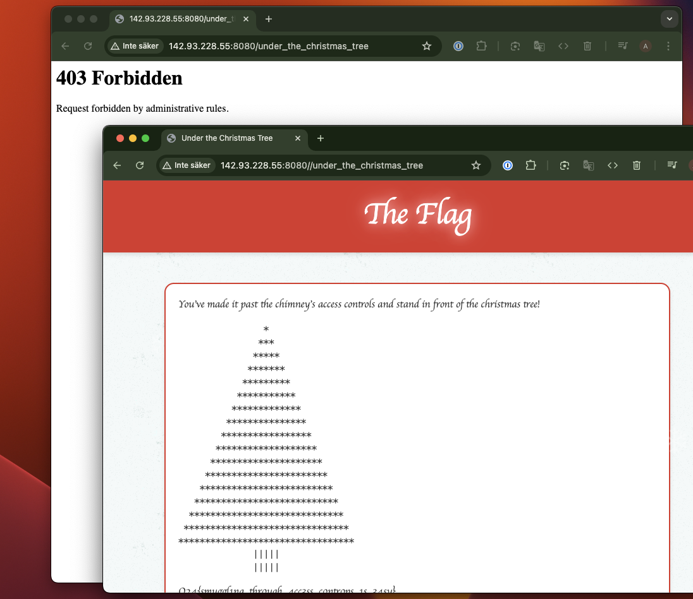
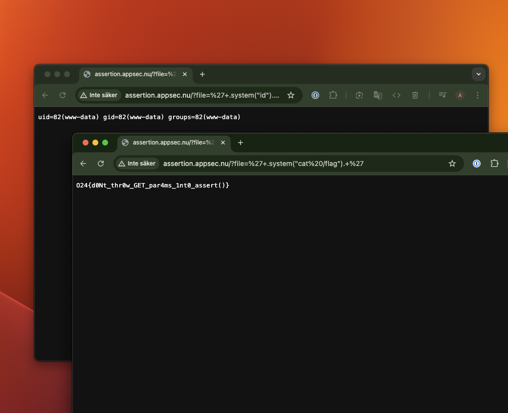
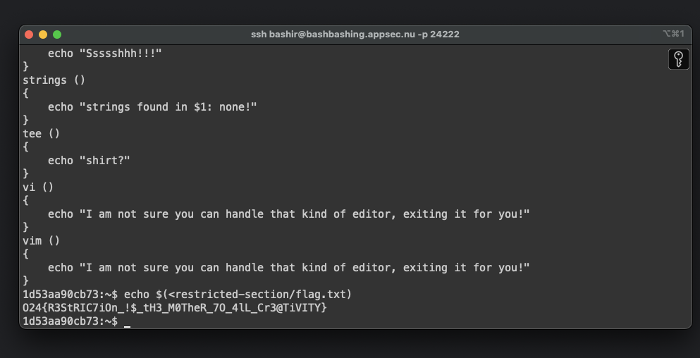

# CTF - friday13(){return json} - ctf.appsec.nu 

## Web
- [The Chimney Bypass](#the-chimney-bypass)
- [Assertion](#assertion)

## Hash Cracking
- [Because What Are Friends For](#because-what-are-friends-for)
- [A Rude Interruption](#a-rude-interruption)

## Misc
- [Pandemic Paranoia](PandemicParanoia.md)
- [Sudoku Mastery](#sudoku-mastery)
- [Rulez - Read the Rules!](#rulez---read-the-rules)

## Reverse
- [No Time no Problems](#no-time-no-problems)

## Forensic
- [I Know Doe's](#i-know-does)

## Programming
- [Jason's Quiz](#jasons-quiz)

## Linux
- [Bashir the Basher](#bashir-the-basher)

---

# Jason's Quiz
**Category:** Programming  
**Value:** 100  
**Time:** December 16th, 4:20:28 PM

**Description:**  
Create a python script to send all the answers in quick order, used a delay of 0.13 seconds.

```python
import socket
import time

# Array med alla svar
answers = [
    '1', '1', '1', 'X', '1', '1', 'X', '2', '1', '1',
    '1', '1', '1', '1', '1', '1', '1', 'X', '2', '1',
    '1', 'X', '2', '1', '1', '1', '1', '2', 'X', '2',
    'X', '2', '1', '2'
]

def jason_quiz():
    # Skapa connection till servern
    host = "json-quiz.appsec.nu"
    port = 1213
    with socket.socket(socket.AF_INET, socket.SOCK_STREAM) as s:
        s.connect((host, port))
        for question_number in range(1, len(answers) + 1):  # Kör igenom alla JSON frågor
            answer = answers[question_number - 1]  # Ge svar från array
            print(f"Ger svar: {answer}")
            s.sendall(answer.encode('utf-8') + b'\n')
            time.sleep(0.13)  # vänta ngt för att undvika skicka svaren för snabbt
            data = s.recv(1024).decode('utf-8')
            print(data)
            
if __name__ == "__main__":
    jason_quiz()
```

**Flag:**
```
O24{w0w_y0U_r3aLLy_kNOw_y0uR_JSON_syNt4x}
```

---

# I Know Doe's
**Category:** Forensic  
**Value:** 100  
**Time:** December 14th, 6:54:56 PM

**Description:**  
Use a forensic tool like ([Autopsy](https://www.autopsy.com/)) to read the deleted flag files. Then combine all the extracted text strings to recover the full flag.



---

# Sudoku Mastery
**Category:** Misc  
**Value:** 100  
**Time:** December 14th, 6:18:28 PM

**Description:**  
First use an [online solver](https://sudokuspoiler.com/sudoku/sudoku9) to solve the sudoku. Then convert the special characters in the sudoku to numbers which is an IP-adress and port number to get the flag.

**Flag:**
```
O24{m4S73r_0f_$uD0ku,_!m_puLl1nG_Y0ur_57r1ng$}
```



---

# Because What Are Friends For
**Category:** Hash Cracking  
**Value:** 100  
**Time:** December 14th, 6:11:32 PM

**Description:**  
Run [Hashcat](https://hashcat.net/hashcat/) with a custom charset and mask. The last digit is known to be between 2-9, so start with 2 and go up...

**Command:**
```
hashcat -m 900 -a 3 bfe85af6a5012498d325db63aac5dd4a --custom-charset1=abcdefghijklmnopqrstuvwxyz_ ?u?1?1?1?1?1?1?112
```



---

# No Time no Problems
**Category:** Reverse  
**Value:** 100  
**Time:** December 13th, 8:22:51 PM

**Description:**  
Running strings on the flag file gets the flag stored in cleartext.

**Command:**
```bash
strings flag | grep "O24"
```



---

# A Rude Interruption
**Category:** Hash Cracking  
**Value:** 100  
**Time:** December 13th, 7:52:20 PM

**Description:**  
Run Hashcat with mode 4300 against the rockyou password file ([rockyou.txt](https://www.kaggle.com/datasets/wjburns/common-password-list-rockyoutxt)) to crack the hash and get the flag.

**Command:**
```
hashcat -m 4300 605428f352781542abeafe5c1832d4aa -a 0 rockyou.txt --show
```

---

# The Chimney Bypass
**Category:** Web  
**Value:** 100  
**Time:** December 13th, 7:00:40 PM

**Description:**  
A 403 bypass challenge. The flag path is protected by a 403 error. Using a double slash instead `//` can easily bypass the 403 protection. 
Ref: [Bypass 403 (Forbidden)](https://github.com/daffainfo/AllAboutBugBounty/blob/master/Bypass/Bypass%20403.md).



---

# Assertion
**Category:** Web  
**Value:** 100  
**Time:** December 13th, 6:54:52 PM

**Description:**  
By accessing the path `/?file=index.php`, the source code of index is shown. Because of the function assert() is used we can inject PHP commands in the application.

Payload: `"/?file='+.system("id").+'"` breaks out and executes PHP commands with system.



---

# Bashir the Basher
**Category:** Linux  
**Value:** 100  
**Time:** December 13th, 6:09:24 PM

**Description:**  
We are in `rbash` (restricted bash). In this mode, a limited set of commands is available. To inspect the environment, run the `set` command. Then use `echo` to get back the flag.

**Commands:**
```bash
# Show contents of the restricted-section folder to see flag.txt
ls -la restricted-section/

# Read the flag content using echo
echo $(<restricted-section/flag.txt)
```




---

# Rulez - Read the Rules!
**Category:** Misc  
**Value:** 100  
**Time:** December 13th, 11:40:00 AM

**Description:**  
The flag is a ROT24 of the text `iwillfollowtherules`.
Use a site like [ROT Cipher Decoder](https://www.dcode.fr/rot-cipher#f0) to convert it into the flag.
